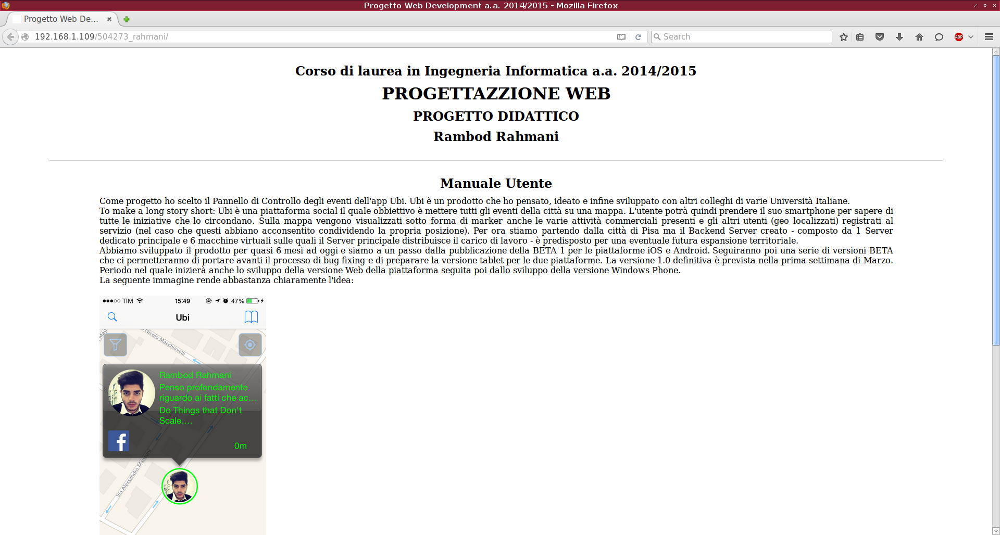
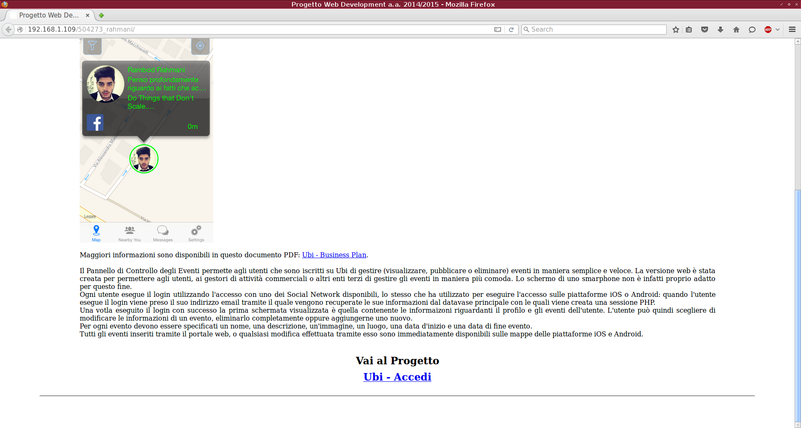
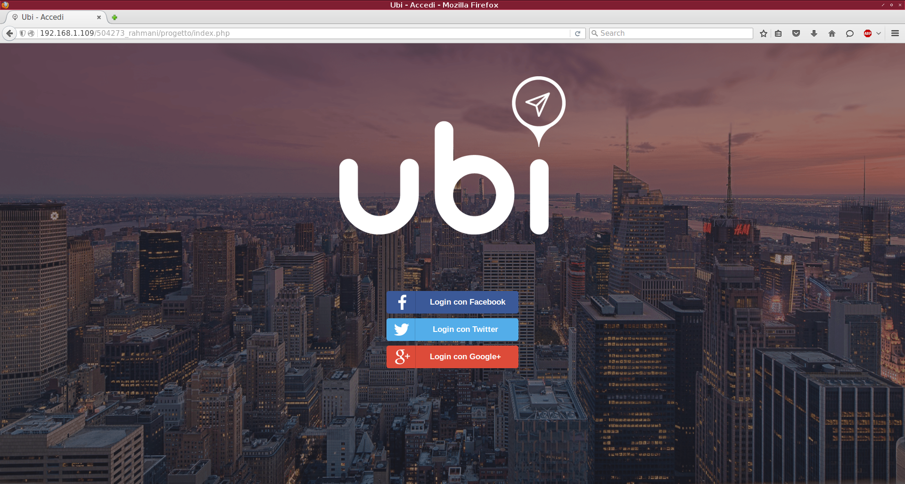
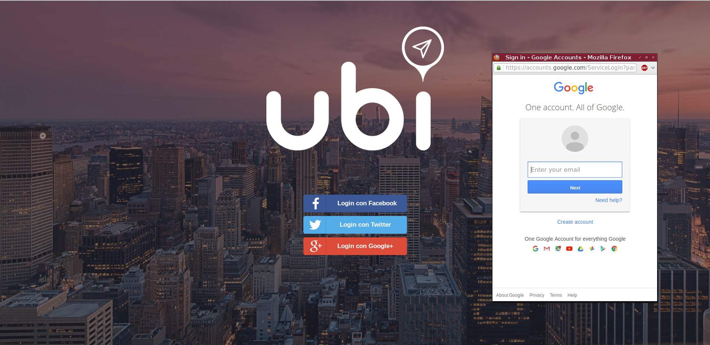

# Progetto Esame Progettazione Web - UNIPI 2015
Progetto presentato per l'esame di Progettazione Web, Universita' di Pisa, A.A. 2015.

Il progetto consiste nella realizzazione del pannello web per il progetto Ubi. Tramite il portale web e' possibile visualizzare, modificare e inserire gli eventi che appariranno poi sulla mappa.

Il progetto Ubi, sviluppato per iOS e Android, lo trovate sempre Open Source ai seguenti indirizzi:

Ubi, Github: https://github.com/rambodrahmani/ubi-app

Ubi, Apple App Store: https://itunes.apple.com/it/app/ubi/id960096837?mt=8

Di seguito alcune screen del portale:

   

##### Maggiori informazioni disponibili sul mio profilo Linkedin: https://www.linkedin.com/in/rambodrahmani

Rambod Rahmani <rambodrahmani@autistici.org>
